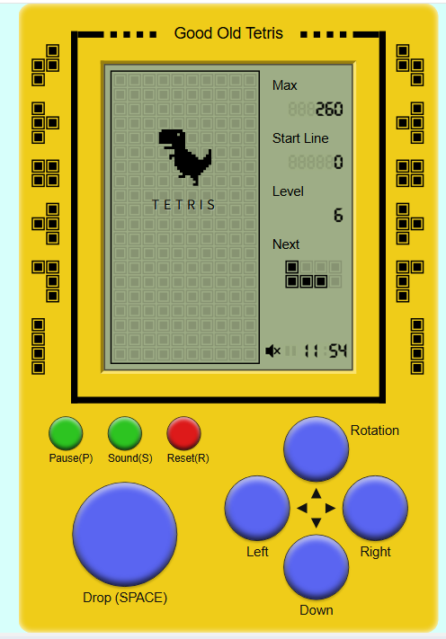
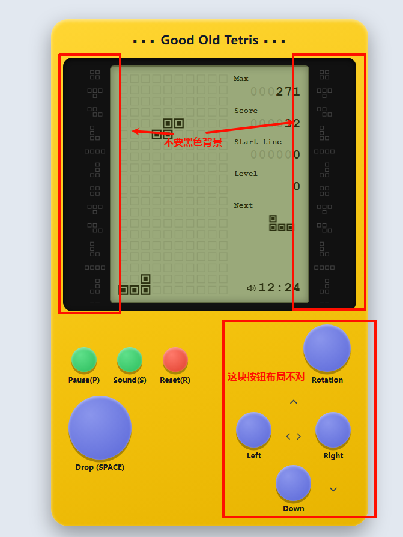
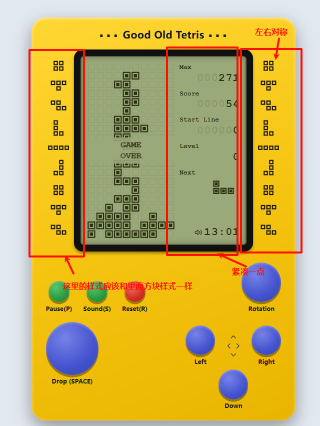
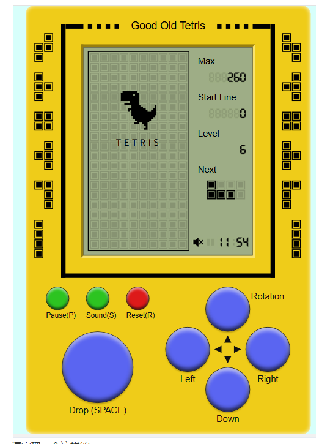
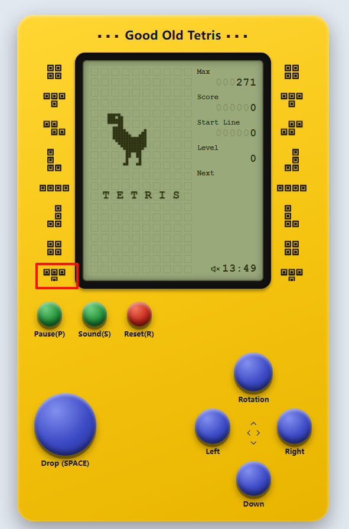
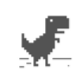
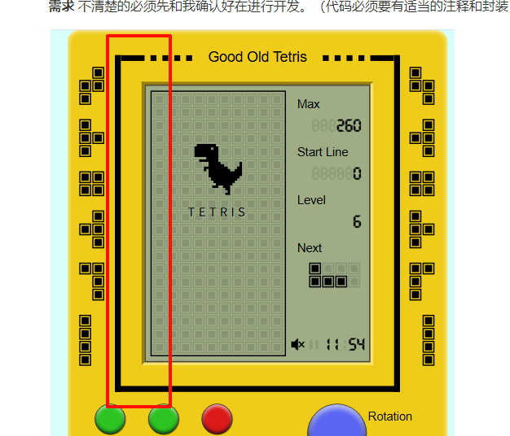
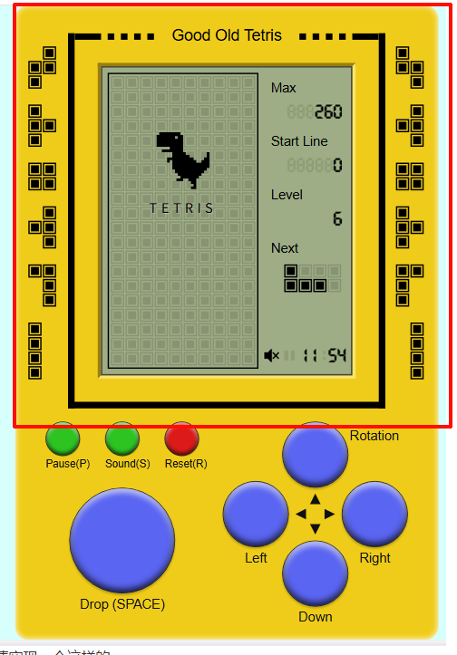

**需求** 不清楚的必须先和我确认好在进行开发。（代码必须要有适当的注释和封装）


请实现一个这样的


**需求** 不清楚的必须先和我确认好在进行开发。（代码必须要有适当的注释和封装）

- 里面的恐龙会左右跳动
- 游戏机的布局和样式要完全符合参考图片的
- 然后键盘操作和点击游戏按钮操作都可以，并且是有按钮点击的特效的。
- ctrl+方向下直接快速落下
- 请问max是什么，业务逻辑是不是有问题


**需求** 不清楚的必须先和我确认好在进行开发。（代码必须要有适当的注释和封装）

- 

- 按钮颜色太浅了
- 然后告诉我在哪里放入媒体文件，以及对应的是哪里。


**需求** 不清楚的必须先和我确认好在进行开发。（代码必须要有适当的注释和封装）

- 
- 按钮更加立体一点颜色跟深色点
- Rotation 放在方向键的top位置，可以稍微小一点。


**需求** 不清楚的必须先和我确认好在进行开发。（代码必须要有适当的注释和封装）

- 下面是图片参考以及文字描述，功能没啥问题了请按照下面参考图这个样式去一比一复刻就行了。（需要兼容移动端）

- 

- ```
  复古掌机俄罗斯方块 布局与样式详细说明
  整体为竖版拟物复古手持掌机造型，100% 还原 90 年代经典俄罗斯方块游戏机的视觉风格，全纯前端可实现，整体纵向矩形结构，从上到下分为「屏幕模块 + 按键模块」，左右两侧带对称装饰。
  一、整体机身容器
  1. 外形与尺寸
  整体为竖直长方形，四角做小圆角处理，模拟塑料掌机外壳
  宽高比例约为 3:4，整体呈竖版手持形态
  机身带轻微外阴影，模拟塑料机身放置在平面上的立体效果
  2. 颜色与质感
  机身主色：明亮金黄色（参考色值 #F5C800），整体做微弱的径向渐变，中心略亮、边缘略暗，模拟塑料外壳的光影质感
  左右两侧对称分布黑色装饰方块阵列：每组为 2×2 的实心小黑方块，纵向等间距排列，模拟老式掌机的螺丝装饰位，上下均匀分布 6-7 组
  3. 整体布局层级
  从上到下分为两大区块：
  上半部分：屏幕模块，约占整机高度的 55%
  下半部分：按键模块，约占整机高度的 45%
  二、屏幕模块（上半部分）
  整体为「黑色外框 + 橄榄绿内屏」的嵌套结构，模拟老式 LCD 液晶屏的凹陷效果。
  1. 屏幕黑色外框
  纯黑色（#000000）粗边框，厚度均匀，完整包裹内屏区域
  边框向内做轻微内阴影，营造屏幕凹陷进机身的视觉效果
  顶部标题栏：边框顶部居中位置显示文字 Good Old Tetris，黑色像素字体；标题左右两侧各有 3 个等距的黑色小方块作为装饰
  外框整体居中放置在机身上下左右的留白中
  2. 液晶屏内屏
  底色：复古橄榄灰绿色（参考色值 #B8C29A），还原老式单色点阵屏的底色
  整体带微弱的磨砂质感，对比度偏低，模拟老液晶屏的视觉特性
  内部分为左右两栏：左侧主游戏区（约占宽度 2/3），右侧信息面板（约占宽度 1/3），两栏之间无分割线
  2.1 左侧主游戏区
  标准 10列 × 20行 的正方形网格，是游戏核心区域
  网格线：比底色稍深的同色系细实线，形成淡淡的方格背景
  待机默认画面：
  居中显示黑色像素恐龙图案（类似 Chrome 断网小恐龙，纯像素块组成，无渐变）
  恐龙正下方居中显示像素字体的 TETRIS 字样，纯黑色
  游戏运行时：所有方块均为纯黑色实心像素块，无描边、无渐变、无抗锯齿，严格对齐网格，完全还原 LCD 屏显示效果
  可扩展：落地位置预览用半透明黑色方块表示
  2.2 右侧信息面板
  从上到下垂直排列 5 组信息，全部左对齐，统一使用黑色像素字体：
  最高分区域
  标签文字：Max
  数值样式：背景带淡灰色虚位数字（如 888），前景叠加实心黑色实际分数，示例数值为 260
  起始行区域
  标签文字：Start Line
  数值样式同上，示例数值为 0
  等级区域
  标签文字：Level
  数值样式同上，示例数值为 6
  下一方块预览
  标签文字：Next
  下方为 4×4 的小型网格，显示下一个方块的黑色像素图形
  底部状态栏
  最底部左侧：黑色像素风格的喇叭音量图标
  最底部右侧：显示时间 11:54，像素字体
  三、按键模块（下半部分）
  所有按键均为圆形凸起塑料质感，通过径向渐变模拟球面高光、底部投影模拟立体按压手感，按键颜色区分功能。
  1. 上排功能按键组（水平等距排列）
  位于屏幕正下方，3 个尺寸一致的小圆按键，从左到右依次为：
  按键 1：亮绿色（#39B54A），按键正下方标注文字 Pause(P)，黑色常规无衬线字体
  按键 2：亮绿色，下方标注文字 Sound(S)
  按键 3：正红色（#ED1C24），下方标注文字 Reset(R)
  2. 左下角下落大按键
  超大号圆形蓝色按键（参考色值 #4F69E5），尺寸远大于功能按键
  按键正下方居中标注文字 Drop (SPACE)，黑色常规字体
  立体效果最强，高光和阴影更明显，突出主要操作键的视觉权重
  3. 右下方向按键组（十字布局）
  4 个尺寸一致的蓝色圆形按键，按「上、左、右、下」十字形分布，尺寸小于下落键、大于功能键：
  上方按键：右上方标注文字 Rotation（旋转功能）
  左方按键：正下方标注文字 Left
  右方按键：正下方标注文字 Right
  下方按键：正下方标注文字 Down
  四个按键的正中心，有一个黑色十字箭头标识：四个方向的小箭头分别指向对应按键，指示方向操作
  四、全局样式规范
  1. 字体规范
  屏幕内所有文字、数字、图标：统一使用像素风格字体（如 Press Start 2P），字号偏小，对齐像素网格
  按键下方说明文字：使用常规无衬线字体（system-ui / Arial），清晰易读，字号适中
  2. 像素风格统一
  屏幕内所有图形元素（方块、恐龙、喇叭图标）均为硬边实心像素块，无圆角、无渐变、无抗锯齿，严格贴合点阵屏的显示特性。
  3. 拟物质感标准
  所有按键：径向渐变模拟球面高光（顶部亮、底部暗），底部加柔和投影，模拟凸起的塑料按键手感
  屏幕区域：内阴影营造凹陷感，底色做低对比度处理，还原老 LCD 屏的复古观感
  机身整体：微弱外阴影，模拟实体掌机放置在平面上的视觉效果
  五、DOM 结构参考层级
  plaintext
  .tetris-handheld（整机机身）
  ├── .side-decoration.left（左侧装饰方块列）
  ├── .side-decoration.right（右侧装饰方块列）
  ├── .screen-module（屏幕模块）
  │   ├── .screen-header（顶部标题栏）
  │   └── .lcd-screen（液晶屏内屏）
  │       ├── .game-board（游戏主画布）
  │       └── .info-panel（信息侧边栏）
  │           ├── .info-item max分数
  │           ├── .info-item start-line
  │           ├── .info-item level
  │           ├── .next-preview 下一方块
  │           └── .status-bar 底部状态栏
  └── .keys-module（按键模块）
      ├── .func-buttons（功能按键行）
      ├── .drop-button（下落大按键）
      └── .direction-buttons（方向按键组）
          ├── 四个方向键
          └── .cross-icon 中心十字标识
  ```

  

**需求** 不清楚的必须先和我确认好在进行开发。（代码必须要有适当的注释和封装）

- 
- 这个被吃掉了，解决下，然后布局可以紧凑一点，太宽了。
- 左右预览的方块我希望和里面的方块样式一样，数量左右各6个吧。

**需求** 不清楚的必须先和我确认好在进行开发。（代码必须要有适当的注释和封装）

这个动画




**需求** 不清楚的必须先和我确认好在进行开发。（代码必须要有适当的注释和封装）

- 边框做成图片那样子
- 
- 然后恐龙像素可以跟家细腻一点。也可以参考图片



